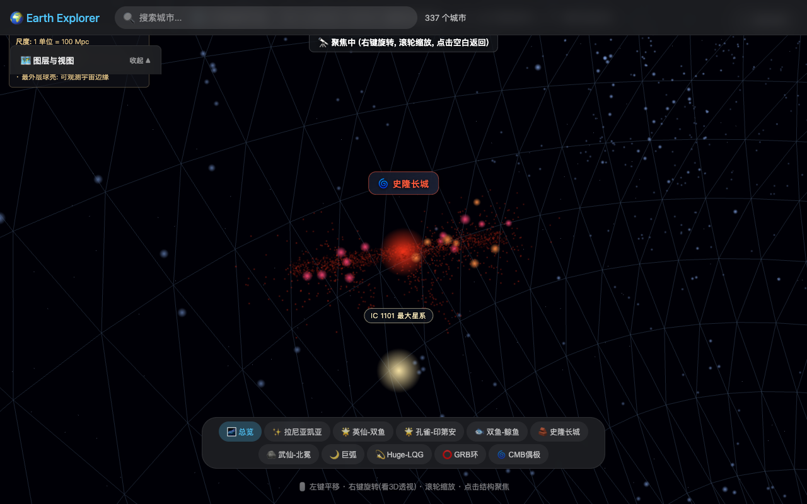
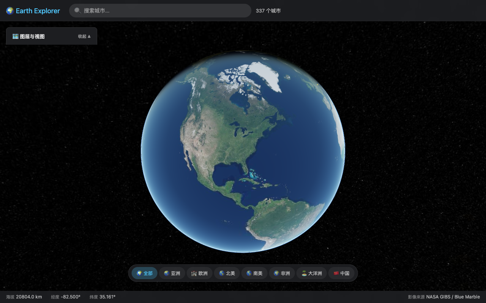
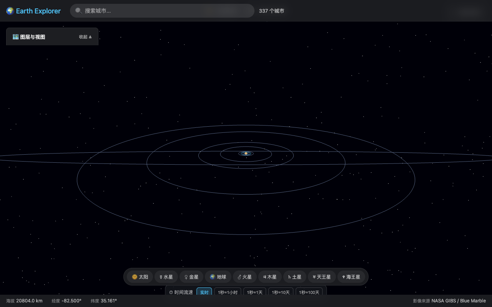
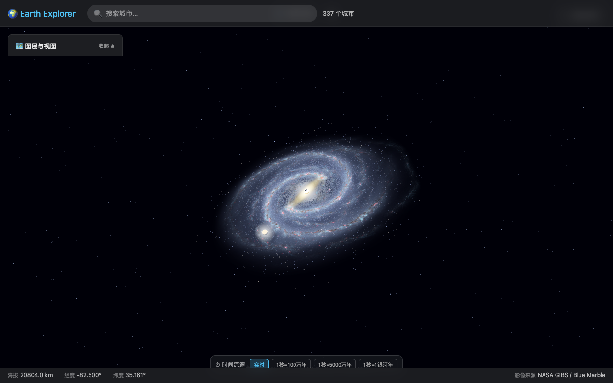
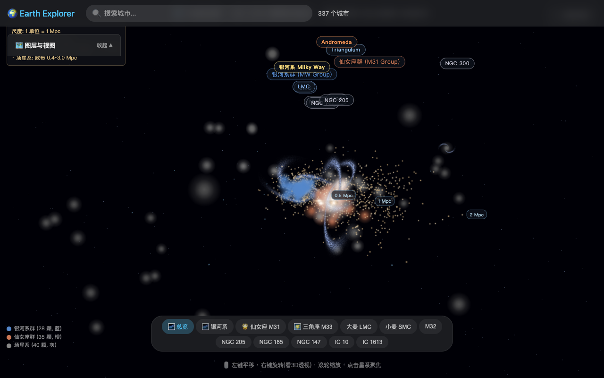
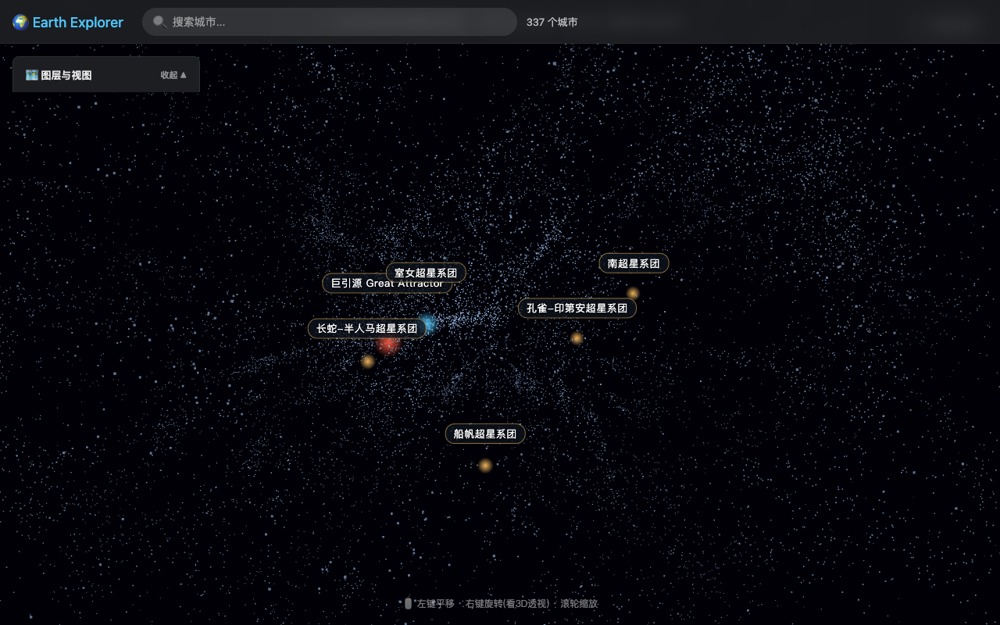
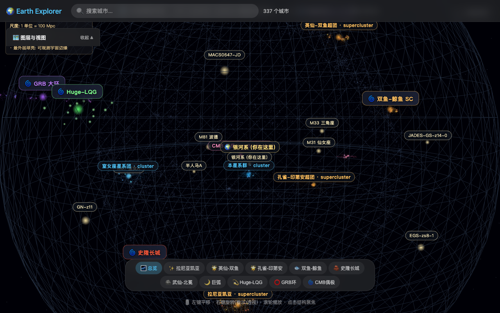

# 🌍 Earth Explorer — 从地球飞到可观测宇宙边缘的 3D 浏览器

> An interactive 3D browser that lets you fly from your backyard to the edge of the observable universe — built with real astronomical data.



## ✨ 一句话描述

打开网页，鼠标点几下，从地球 → 太阳系 → 银河系 → 本星系群 → 室女超团 → 拉尼亚凯亚 → 可观测宇宙边界（46.5 Gly）—— 全部用 **NASA / ESA 真实天文数据 + 程序化 3D 模型** 渲染。

## 🚀 在线体验

👉 **https://wzirong.github.io/earth-explorer/**

桌面 App：见 [Releases](https://github.com/wzirong/earth-explorer/releases) 页面（macOS）

## 📸 截图

| 地球 · Blue Marble | 太阳系 · 真实比例 | 银河系 · ESO 真实贴图 |
|---|---|---|
|  |  |  |

| 本星系群 · 程序化漩涡星系 | 拉尼亚凯亚 · 9 个超团核心 | 可观测宇宙边界 · 46.5 Gly |
|---|---|---|
|  |  |  |

## 🌌 包含什么

### 7 个空间尺度视图

| 视图 | 尺度 | 数据源 |
|---|---|---|
| 🌍 地球 | 12,742 km | NASA GIBS / Blue Marble + VIIRS 卫星影像 |
| ☀️ 太阳系 | 30 AU | NASA 行星贴图 + 真实公转轨道 |
| 🌌 银河系 | 100,000 ly | ESO VVV 红外巡天图 + 银心 Sgr A* |
| 🌃 本星系群 | 3 Mly | McConnachie 2012 150 颗真实星系 |
| 🌠 拉尼亚凯亚 | 250 Mly | 2MRS 18856 颗真实星系 + 9 个超团核心 |
| 🌐 室女座超星系团 | 100 Mly | EVCC 2096 颗 + M87 喷流 |
| 🌌 可观测宇宙 | 46.5 Gly | 2MRS + SDSS + 12 个大尺度结构 3D 模型 |

### 12 个宇宙大尺度结构（点击放大看 3D 模型）

- 拉尼亚凯亚 / 英仙-双鱼 / 孔雀-印第安 / 双鱼-鲸鱼 超团
- 史隆长城 / 武仙-北冕长城
- 巨弧 / GRB 大环 / Huge-LQG
- 本星系群 / 室女座星系团 / CMB 偶极

每个都是独立的 3D 程序化模型（粒子云 / 长条 / 弧形 / 圆环 / 点阵）。

### 11 个著名星系
M31 仙女座 / M33 三角座 / M81 波德 / 半人马 A / M87 室女 A / IC 1101 最大星系 / EGS-zs8-1 / MACS0647-JD / GN-z11 / JADES-GS-z14-0 / 银河系（你在这里）

## 🎮 怎么玩

| 操作 | 快捷键 / 鼠标 |
|---|---|
| 平移视角 | 左键拖动 |
| 旋转视角 | 右键拖动 |
| 缩放 | 滚轮 |
| 切换图层 | 点击顶部 "🗺️ 图层与视图" |
| 飞向星系 | 点视图内任意星系标签或底部导航 |
| 切换暗色/日间 | 右上角 sun icon |

## 🛠️ 技术栈

- **Three.js** r150+ — 3D 渲染
- **Cesium.js** — 地球 + NASA GIBS 卫星影像图层
- **CSS2DRenderer** — HTML 标签叠加在 3D 空间
- **程序化纹理** (Python + PIL) — 漩涡星系纹理生成
- **真实数据**：
  - 2MRS (2MASS Redshift Survey) 18856 颗近邻星系
  - SDSS DR18 类星体
  - Cosmicflows-2 / McConnachie 2012 本星系群
  - ESO VVV 银河系红外巡天图
  - NASA GIBS BlueMarble_NextGeneration
  - NASA Solar System Dynamics

## 🏃 本地运行

```bash
git clone https://github.com/wzirong/earth-explorer.git
cd earth-explorer
python3 -m http.server 8765
# 打开 http://127.0.0.1:8765
```

或者用 Node：
```bash
npx http-server -p 8765
```

无需 npm install（纯前端 vanilla JS）。

## 📦 项目结构

```
earth-explorer/
├── index.html              # 地球主视图入口
├── cesium-renderer.js      # Cesium 地球渲染
├── observable-3d-view.html # 可观测宇宙 3D
├── laniakea-3d-view.html   # 拉尼亚凯亚 3D
├── local-group-3d-view.html # 本星系群 3D
├── galaxy-3d-view.html     # 银河系 3D
├── solar-system-view.html  # 太阳系 3D
├── three.min.js
├── CSS2DRenderer.js
├── data/
│   ├── laniakea_spherical.json    # 18856 颗 2MRS 星系
│   ├── local_group_3d.json        # 150 颗本星系群
│   ├── observable_structures.json # 12 大尺度结构 + 11 著名星系
│   ├── cities_geo.json
│   └── galaxy_tex/                # 程序化漩涡星系纹理 (10 张 PNG)
├── gen_galaxy_tex.py        # 纹理生成器
├── build/                   # Electron 桌面 app
└── dist/                    # 打包输出
```

## ✨ 为什么这个项目

现有的"宇宙尺度"网站要么是 YouTube 视频（被动看），要么是静态信息图（不能交互），要么数据粗糙不真实。

Earth Explorer 的目标是：**真实数据 + 程序化生成 + 流畅交互**，让你自己飞过去感受宇宙到底有多大。

## 🌟 Star History

如果觉得有意思，给个 ⭐ Star 让更多人看到。

## 📜 License

MIT — 自由使用、修改、商用。

## 🙏 数据致谢

- 2MRS / 2MASS — IPAC/Caltech
- SDSS — Sloan Digital Sky Survey
- Cosmicflows-2 / McConnachie 2012
- NASA GIBS / EOSDIS
- ESO VISTA VVV Survey

---

> 💌 联系：GitHub Issues 或 wzirong@github
